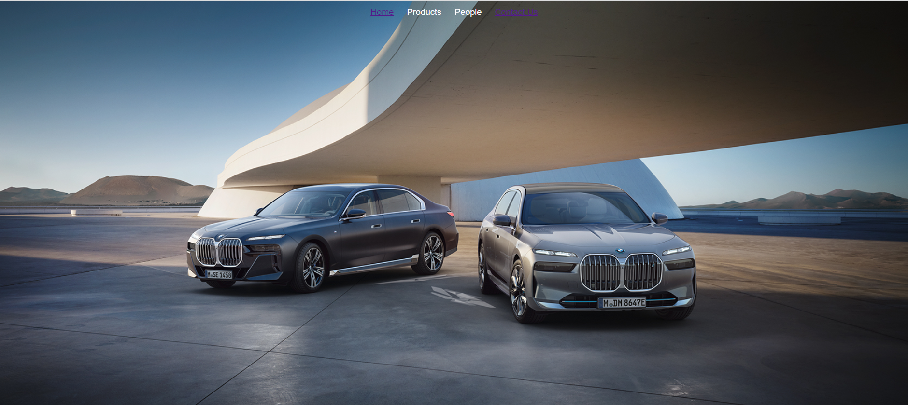
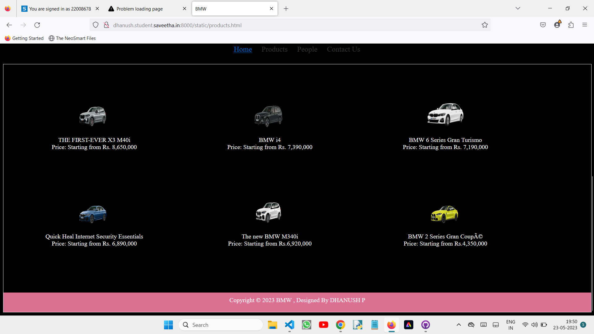
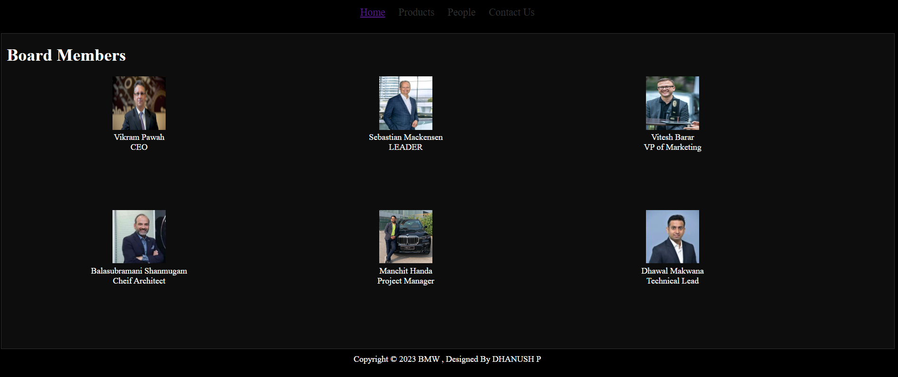
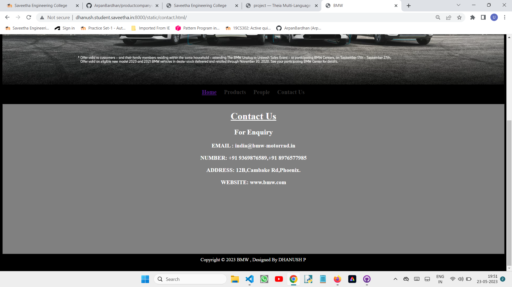
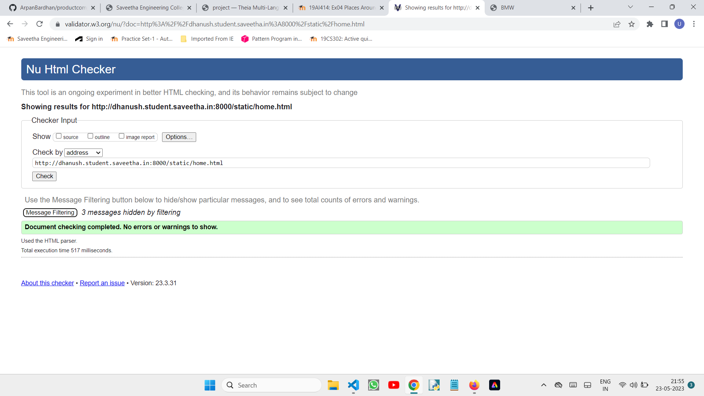

## Web Design for a Software Product Company
## AIM:
To web Design for a Software Product Company
## DESIGN STEPS:
### Step 1:
Requirement collection.

### Step 2:
Creating the layout using HTML and CSS.

### Step 3:
Updating the sample content.

### Step 4:
Choose the appropriate style and color scheme.

### Step 5:
Validate the layout in various browsers.

### Step 6:
Validate the HTML code.

### Step 6:
Publish the website in the given URL.

## PROGRAM :
```
home.html
<!DOCTYPE html>
<html lang="en">

<head>
    <title>BMW</title>
    <link rel="stylesheet" href="./css/layout.css" />
    <link rel="icon" href="./html/icon.png" type="image/x-icon" />
</head>

<body>
    <div class="container">
        <div class="menu">
            <div class="menuitemselected"><a href="/static/home.html">Home</a></div>
            <div class="menuitem"><a href="/static/products.html">Products</a></div>
            <div class="menuitem"><a href="/static/images/people.html">People</a></div>
            <div class="menuitemselected"><a href="/static/contact.html">Contact Us</a></div>
        </div>
        </div>
        <div class="footer">
         Copyright &#169; 2023 BMW , Designed By DHANUSH P
      </div>

</body>

</html>
people.html

<!DOCTYPE html>
<html lang="en">
  <head>
    <title>BMW</title>
    <link rel="stylesheet" href="/static/css/lay3.css" />
  </head>

  <body>
    <div class="container">
      <div class="banner"></div>
      <div class="menu">
        <div class="menuitemselected"><a href="/static/home.html/">Home</a></div>
        <div class="menuitem"><a href="/static/products.html/">Products</a></div>
        <div class="menuitem"><a href="/static/images/people.html/">People</a></div>
        <div class="menuitem"><a href="/static/contact.html/">Contact Us</a></div>
     
      </div>
      <div class="content">
        <div class="productcontent">    
          <h1>Council Members</h1>
          <div class="productitem"> 
          <div class="itemimage">
          
          </div>
          <div class="itemname">Vikram Pawah</div>
          <div class="itemprice">CEO</div>
        </div>
        <div class="productitem"> 
          <div class="itemimage">
          
          </div>
          <div class="itemname">Sebastian Mackensen</div>
          <div class="itemprice">LEADER</div>
        </div>
        <div class="productitem"> 
          <div class="itemimage">
          
          </div>
          <div class="itemname">Vitesh Barar</div>
          <div class="itemprice">VP of Marketing</div>
        </div>
        <div class="productitem"> 
          <div class="itemimage">
          
          </div>
          <div class="itemname">Balasubramani Shanmugam</div>
          <div class="itemprice">Cheif Architect</div>
      </div>
      <div class="productitem"> 
        <div class="itemimage">
        
        </div>
        <div class="itemname">Manchit Handa</div>
        <div class="itemprice">Project Manager</div>
      </div>
      <div class="productitem"> 
      <div class="itemimage">
      
      </div>
      <div class="itemname">Dhawal Makwana</div>
      <div class="itemprice">Technical Lead</div>
      </div>
      </div>
        </div>
      <div class="footer">
        Copyright &#169; 2023 BMW , Designed By DHANUSH P
    </div>    
      </div>
    </div>
  </body>
</html>
contactus.html

<!DOCTYPE html>
<html lang="en">
  <head>
    <title>BMW</title>
    <link rel="stylesheet" href="/static/css/lay2.css" />

  </head>

  <body>
    <div class="container">
      <div class="banner"></div>
      <div class="menu">
         <div class="menuitemselected"><a href="/static/home.html/"><b>Home</b></a></div>
        <div class="menuitem"><a href="/static/products.html/"><b>Products</b></a></div>
        <div class="menuitem"><a href="/static/images/people.html/"><b>People</b></a></div>
        <div class="menuitem"><a href="/static/contact.html/"><b>Contact Us</b></a></div>
      </div>
      <div class="content">
          <div class="us">
              <h1>
                  <u>Contact Us</u>
                </h1>
                <h2>For Enquiry</h2>
                        <h3>EMAIL : india@bmw-motorrad.in</h3>
                        <h3>NUMBER: +91 9369876589,+91 8976577985</h3>
                        <h3>ADDRESS: 12B,Cambake Rd,Phoenix.</h3>
                        <h3>WEBSITE: www.bmw.com</h3>
          </div>
            </div>
            <div class="footer">
        Copyright &#169; 2023 BMW , Designed By DHANUSH P
      </div>
    </div>
  </body>
</html>
products.html

<!DOCTYPE html>
<html lang="en">
  <head>
    <title>BMW</title>
    <link rel="stylesheet" href="/static/css/lay.css" />
    <link rel="icon" href="/static/images/logopp.png" type="image/x-icon" />
  </head>

  <body>
    <div class="container">
      <div class="banner"></div>
      <div class="menu">
        <div class="menuitemselected"><a href="/static/home.html/">Home</a></div>
        <div class="menuitem"><a href="/static/products.html/">Products</a></div>
        <div class="menuitem"><a href="/static/images/people.html/">People</a></div>
        <div class="menuitem"><a href="/static/contact.html/">Contact Us</a></div>
     
      </div>
      
      <div class="content">
        <div class="productcontent">
            <h1 class="hrr">BMW</h1>
          <div class="productitems">
              <div class="productitem"> 
                  <div class="itemimage">
                  
                  </div>
                  <div class="itemname">THE FIRST-EVER X3 M40i</div>
                  <div class="itemprice">Price: Starting from Rs. 8,650,000 </div>
              </div>
              <div class="productitem"> 
                  <div class="itemimage">
                  
                  </div>
                  <div class="itemname">BMW i4</div>
                  <div class="itemprice">Price: Starting from Rs. 7,390,000 </div>
              </div>

              <div class="productitem"> 
                <div class="itemimage">
                
                </div>
                <div class="itemname">BMW 6 Series Gran Turismo</div>
                <div class="itemprice">Price: Starting from Rs. 7,190,000</div>
              </div><div class="productitem"> 
                  <div class="itemimage">
                  
                  </div>
                  <div class="itemname">Quick Heal Internet Security Essentials</div>
                  <div class="itemprice">Price: Starting from Rs. 6,890,000  </div>
              </div>
              <div class="productitem"> 
                <div class="itemimage">
                
                </div>
                <div class="itemname">The new BMW M340i</div>
                <div class="itemprice">Price: Starting from Rs.6,920,000 </div>
              </div>
              <div class="productitem"> 
                <div class="itemimage">
                
                </div>
                <div class="itemname">BMW 2 Series Gran Coupé</div>
                <div class="itemprice">Price: Starting from Rs.4,350,000 </div>
              </div>
          </div>
          </div>        
          
        
      <div class="footer">
        Copyright &#169; 2023 BMW , Designed By DHANUSH P
      </div>
    </div>
  </body>
</html>
```
## OUTPUT:



### product Page:



### people page


### contact page


### HTML VALIDATOR


## Result:
Thus a website is designed for the software product company and the HTML,CSS code are validated.